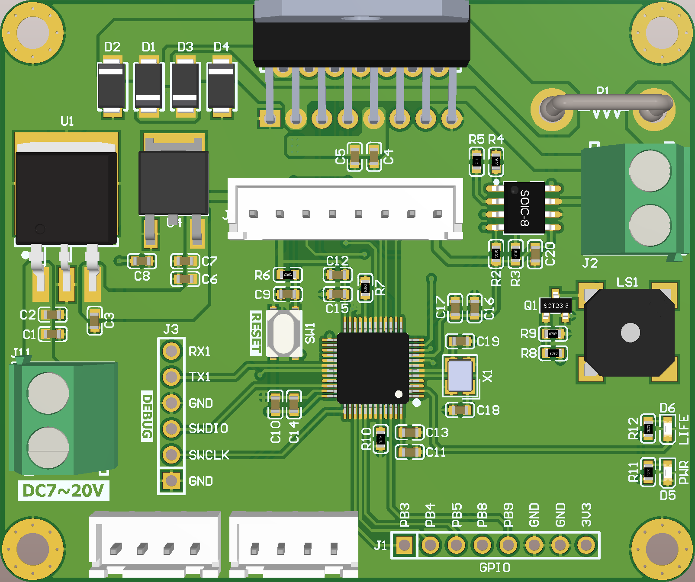
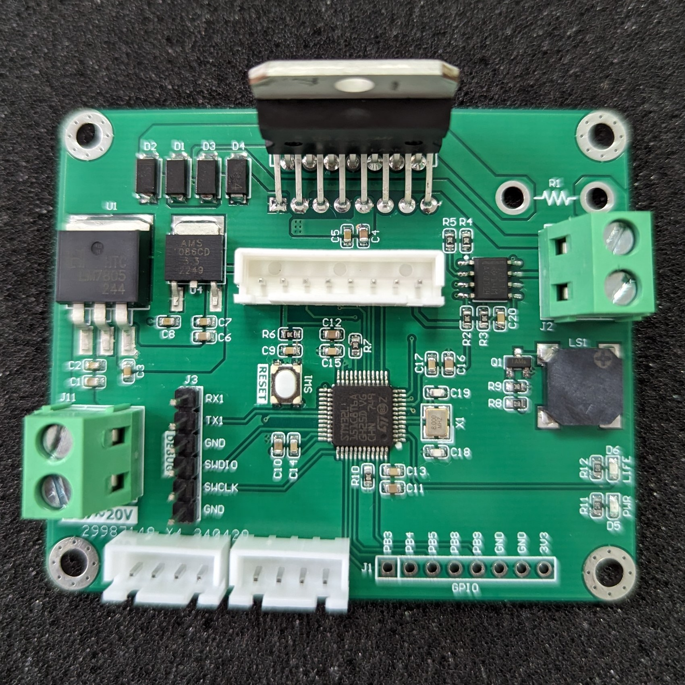
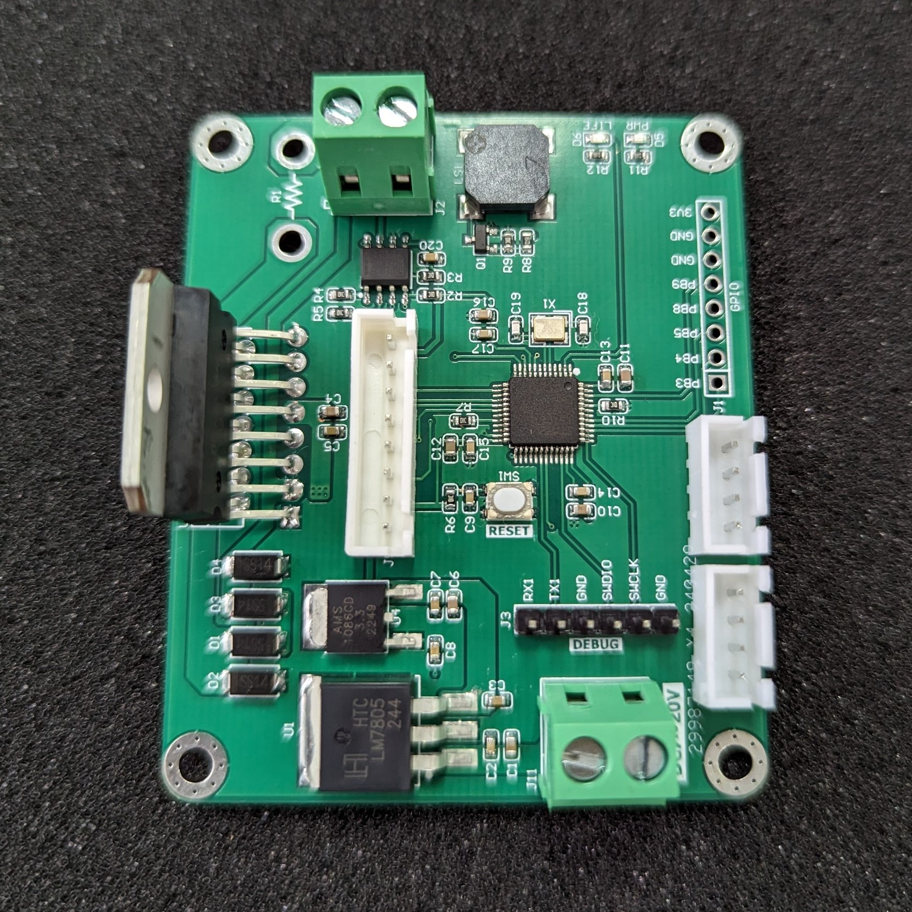
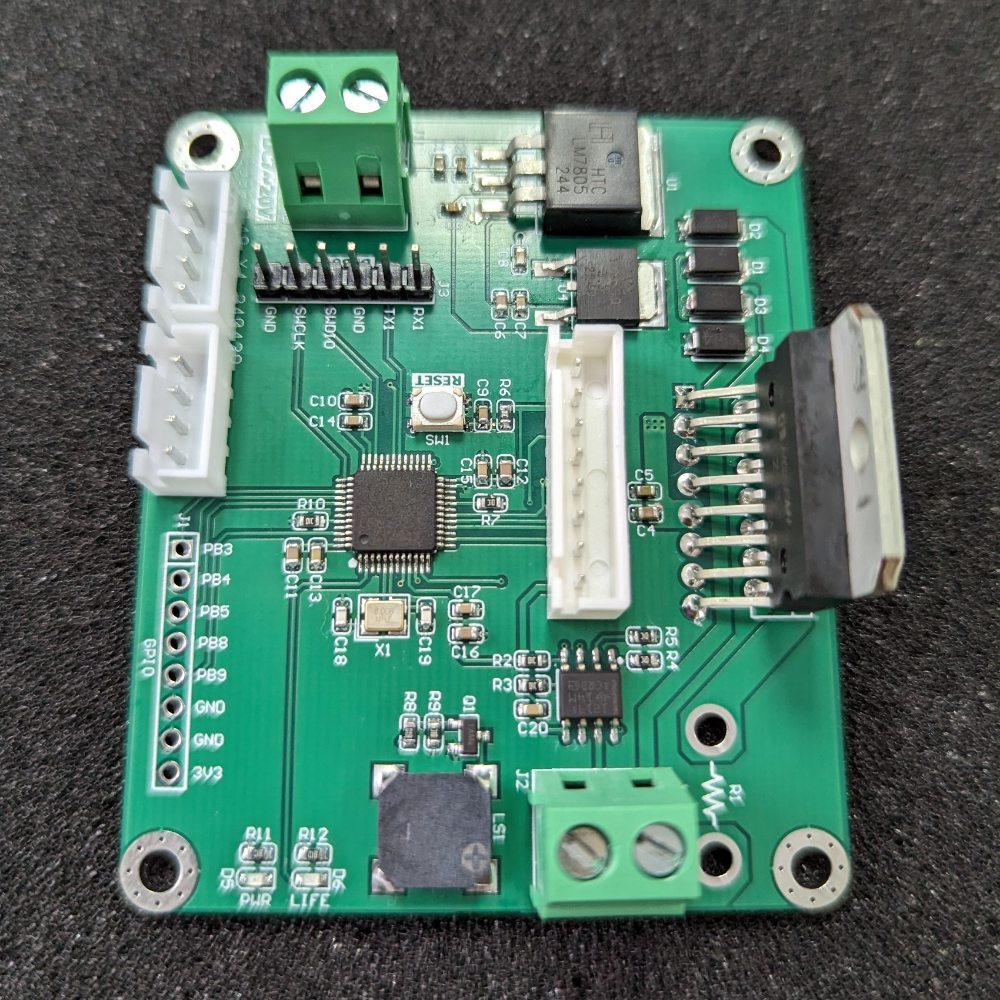
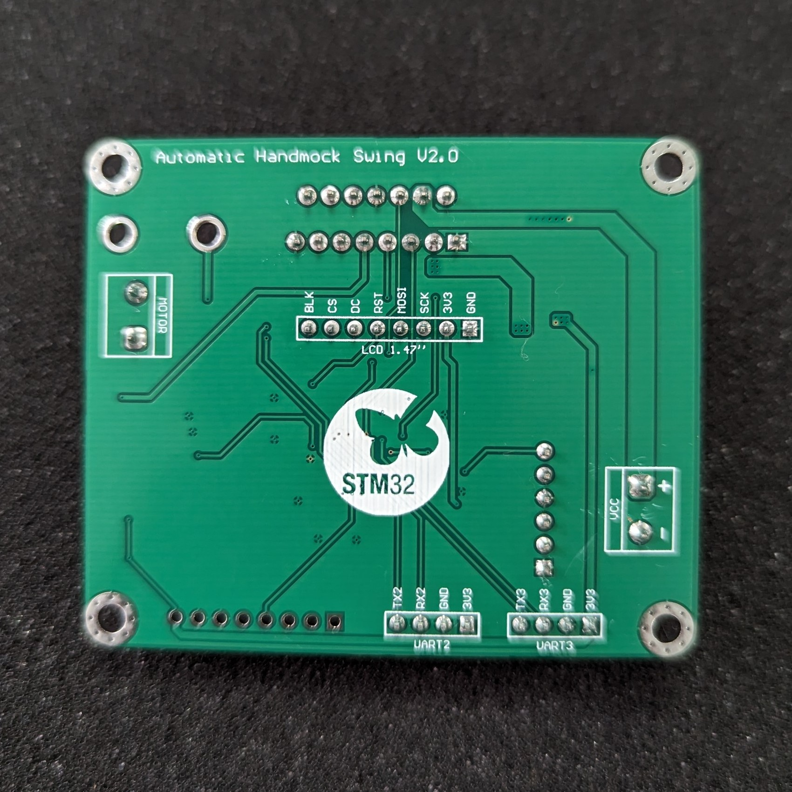

##  Automatic Handmock Swing

##
The hardware designing based on STM32L151 for control the DC motor of automatic handmock swing machine. Include functions:
- Reading the voltage, current, velocity.
- Calculating the output PWM with PID algorithm.
- Extended functions: logging data  to server, music player,...

### Simple Tasker Kernel 
The firmware of system is programmed with "simple tasker kernel". An event-driven base system in embedded programming.

### Hardware

### References
| Topic | Link |
| ------ | ------ |
| Tutorial of "STK" | https://github.com/NgoThanhNha/template-stk-stm32f030 |